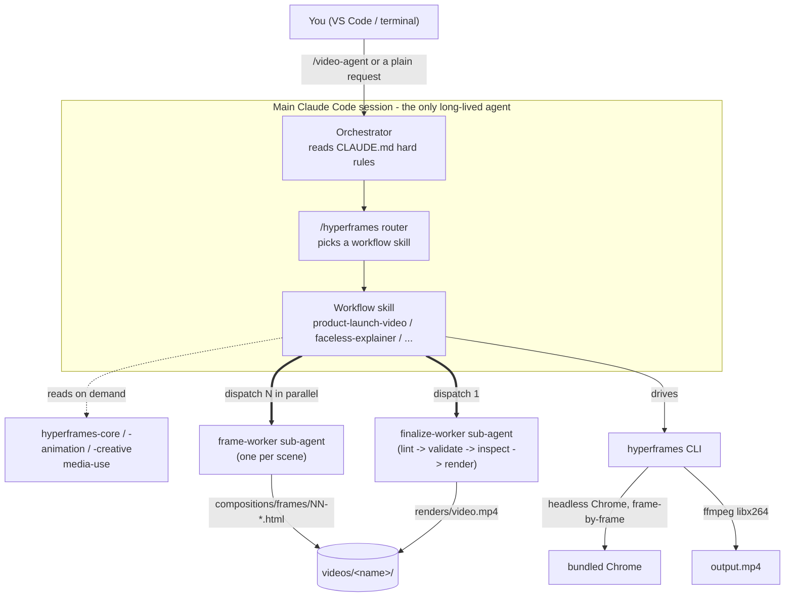

# PromoKit

Turn any product (URL / screenshots / screen recording) into a promo video,
tutorial, or pitch deck - using Claude Code (Pro subscription, $0 API cost)
+ HyperFrames (open source, $0 render cost).

## First time (once per machine)

### Windows
1. Unzip somewhere like `C:\dev\promo-kit`
2. Open the folder in VS Code -> Terminal -> New Terminal (PowerShell)
3. Run:  `powershell -ExecutionPolicy Bypass -File .\setup.ps1`
4. If npm warns about scripts:  `npm approve-scripts --allow-scripts-pending`

### Mac / Linux
1. Unzip somewhere like `~/promo-kit`
2. Open the folder in VS Code -> Terminal (or use Terminal.app, `cd` into it)
3. Run:  `bash setup.sh`   (installs Homebrew automatically if missing)

### Both, after setup
4. Run:  `claude` -> log in with your Claude account (subscription), NOT API
5. Inside Claude:  `/status`  -> must show your Pro plan

Use setup.ps1 on Windows OR setup.sh on Mac/Linux - pick the one for your OS.
The scripts do the same thing; only the installer (winget vs brew) differs.

## Every video after that
1. Open this folder in VS Code, open terminal, type `claude`
2. Type `/video-agent` and answer the short guided interview (video type,
   style, name, and a URL / screenshots / a screen recording) - no need to
   open PROMPTS.md or hand-edit a prompt. See "Guided intake" below.
3. Walk away ~15-30 min -> `./videos/<name>/output.mp4` (default is now a
   tight <=30s conversion cut - see Quality bar in CLAUDE.md; a fuller 45-90s
   tour takes longer and is an explicit opt-in in the interview)

PROMPTS.md still works if you'd rather copy/paste a prompt by hand - `/video-agent`
builds the exact same brief from your answers, it's just faster.

### Guided intake (`/video-agent`)

`/video-agent` is a custom Claude Code command (`.claude/commands/video-agent.md`)
that interviews you instead of you editing PROMPTS.md:
1. **What are we making?** - SaaS/software (then: full launch or one new
   feature), a single physical product (a bag, book, clothing, gadget - not a
   whole store), an e-commerce store/catalog (the whole site), or an
   informational website.
2. **Style** - polished cinematic (default) or UGC/testimonial.
3. **Name** - becomes `./videos/<name>/`.
4. **Input** - a URL, screenshots/photos, a screen recording, or URL + recording.

If you pick screenshots or a recording, Claude creates `./videos/<name>/input/`
and tells you that path - drop the file(s) in there via your file explorer,
paste an image directly into the Claude chat box (the VS Code extension
accepts pasted images), or give an absolute path and Claude copies it in.
Your answers get mapped onto the exact same brief PROMPTS.md would have used
(same duration/structure/motion/voice/audio spec), then routed to
`/product-launch-video` or `/website-to-video` automatically - covers product
launches, SaaS/feature promos, e-commerce, and UGC-style videos alike.

## Folder layout
```
promo-kit/
  setup.ps1      one-time installer + API-key remover
  CLAUDE.md      mission rules Claude Code auto-reads every session
  PROMPTS.md     copy-paste prompts (promo / tutorial / deck)
  scripts/log-usage.mjs  per-video token usage logger (see Token usage log below)
  .claude/skills/  HyperFrames skills (created by setup)
  videos/        one subfolder per video (created as you go)
  videos/USAGE_LOG.md    running log of token usage per video
```

## How the agent system works

**The "agent" is Claude Code itself** - there's no separate AI service for video.
Claude Code reads `CLAUDE.md`, picks a HyperFrames skill, writes an HTML/CSS/JS
composition, and drives a real (headless) Chrome browser to capture it
frame-by-frame. ffmpeg then encodes those frames into `output.mp4`. No image or
video-generation model is involved - it's a browser rendering a web page.

### Architecture at a glance

One long-lived orchestrator (your Claude Code session) runs almost every
phase itself; it only spins up short-lived sub-agents twice - to build scenes
in parallel, and for one combined lint/render/QC pass at the end.



Confirmed against real runs: `videos/RawShift` dispatched 7 frame-workers in
parallel + 1 finalize-worker; `videos/Syllaby` dispatched 5 + 1 (one
frame-worker per `## Frame` block in that project's `STORYBOARD.md`). See
"Resuming a stopped run" below for how `progress.json` lets any of this
survive a killed session.

### GPU - not required

Everything renders on CPU by default:
- **Frame capture** - HyperFrames ships a pinned, bundled Chrome that captures
  each frame in software mode unless you opt in to GPU.
- **Video encoding** - ffmpeg encodes with the software `libx264` encoder by
  default.

GPU is available as two independent, optional accelerators (off unless asked):

| Flag | Speeds up | Default |
|---|---|---|
| `--browser-gpu` | Chrome/WebGL rendering during capture | auto on local machines, off in Docker |
| `--gpu` | ffmpeg hardware encode (NVENC / VideoToolbox / VAAPI / QSV) | off |

A laptop with no dedicated GPU renders fine, just slower on heavy Three.js/WebGL
scenes. Run `npx hyperframes doctor` to check CPU/memory/Chrome/ffmpeg health if a
render is slow or failing.

### Workflow

```
/video-agent - guided interview (type, style, length, name, input source)
        |
        v
Claude Code reads ./CLAUDE.md (hard rules + quality bar: <=30s default)
        |
        v
/hyperframes (router skill) picks a workflow
   product-launch-video | website-to-video | slideshow | ...
        |
        v
scaffold ./videos/<name>/ + meta.json + progress.json (phase: research)
        |
        v
research - capture URL/screenshots, extract brand/copy -> frame.md      \
        |                                                                 |
        v                                                                 |
storyboard - STORYBOARD.md + SCRIPT.md; audio.mjs (TTS/BGM/SFX)          |  all run
        |     kicked off in the background, not queued behind it          }  in the
        v                                                                 |  main
   author the shot-sequence design per frame.md/STORYBOARD.md            |  session -
        |                                                                 |  not
        v                                                                /   delegated
[subagent] frame-worker x N - one dispatched IN PARALLEL per storyboard
   scene/frame; each writes its own compositions/frames/NN-*.html only
        |
        v
assemble-index.mjs + captions.mjs -> index.html
        |
        v
[subagent] finalize-worker x 1 - one combined pass: inject transitions,
   lint -> validate -> inspect (fixes findings itself, bounded retries),
   glance at a snapshot contact sheet, THEN render --quality standard once
        |
        v
./videos/<name>/output.mp4  (+ duration, render time, weakest-scene
   self-critique, token usage from log-usage.mjs)
```

Confirmed against real runs: `videos/RawShift` dispatched 7 frame-workers in
parallel (one per scene) + 1 finalize-worker; `videos/Syllaby` dispatched 5 +
1 - see each project's `STORYBOARD.md` (`## Frame` blocks) against its
`compositions/frames/` output. Everything upstream of the frame-worker
fan-out (capture, storyboard, script, visual design) runs in the main
orchestrator session itself, not as a delegated sub-agent - only the per-scene
build and the final lint/render/QC pass are dispatched as their own
sub-agents, each with a fresh context window and a short summary reported
back. This keeps the full scraped page, verbose lint output, and raw frames
out of the main conversation without pretending every phase is delegated.
`progress.json` is updated after each phase, so an interrupted run resumes at
the right step instead of restarting (see "Resuming a stopped run" below).

If lint/preview/render fails, Claude reads the error, fixes the composition, and
retries (up to 3 attempts before asking you).

### Resuming a stopped run

If a session hits its limit, your laptop shuts down, or you just close the
terminal mid-render, nothing is lost. Each video keeps a live checkpoint at
`./videos/<name>/progress.json` (which phase is done, which is next, and
notes on where it left off) - state lives on disk, not in the chat. Reopen
`claude` in this folder and say something like:

```
Continue the video in ./videos/<name>/ - check progress.json and finish it.
```

Claude reads the checkpoint and resumes at the incomplete phase instead of
starting over.

### Token usage log

Every finished video gets its Claude Code token usage logged automatically:
`./videos/<name>/usage.json` (full breakdown by model) and one row appended to
`./videos/USAGE_LOG.md` (input/output/cache tokens, model(s), sessions
spanned). This comes from `scripts/log-usage.mjs`, which reads the local
Claude Code transcripts for this project - nothing is sent anywhere.

### Agent skills directory structure

HyperFrames' skills are duplicated across three trees so different agent CLIs
(each of which looks for skills in a different conventional location) can all
find them:

```
promo-kit/
  .claude/skills/<skill>/SKILL.md + references/   Claude Code's own lookup path
  .agents/skills/<skill>/SKILL.md + references/   generic ".agents" convention (mirrors .claude/skills)
  agent/skills/<skill>/SKILL.md                   singular "agent" convention (adapted wording;
                                                   currently missing media-use, product-launch-video)
  skills-lock.json                                pins each skill's source repo + content hash
```

`skills-lock.json` records where each skill came from (`heygen-com/hyperframes` on
GitHub) and a hash of its contents, so `npx hyperframes skills update` can detect
drift and refresh these trees.

This project also has two hand-written, project-local additions that are
**not** part of the vendored/auto-synced skill trees above (so `skills update`
never touches them):

```
promo-kit/
  .claude/commands/video-agent.md   the /video-agent guided-intake slash command
  assets/bgm-library/<mood>/        bundled license-clear BGM tracks (Pixabay
                                     Content License, same as the bundled SFX) -
                                     see its README.md to populate
```

> This section is a snapshot of the current layout, not hand-maintained prose -
> see the "keep docs in sync" rule in `CLAUDE.md`.

## Zero-cost guarantees
- setup.ps1 deletes ANTHROPIC_API_KEY / ANTHROPIC_BASE_URL vars
- Log in with subscription only; if Claude ever offers "continue with
  API credits", decline - just wait for the 5-hour window to reset
- HyperFrames is Apache 2.0: no per-render fees, renders on your laptop
